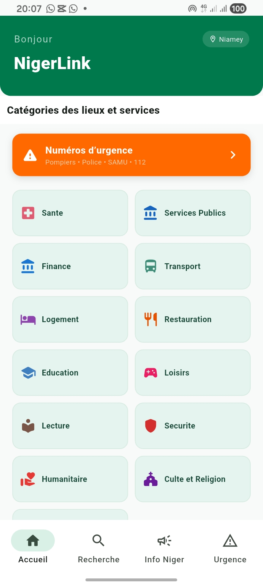
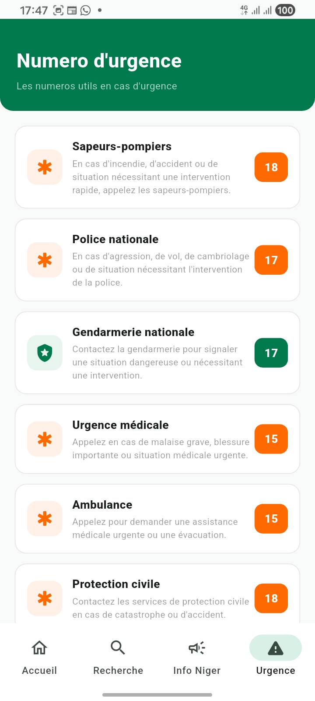
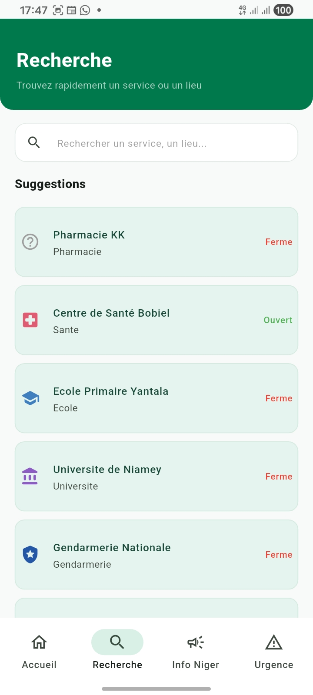
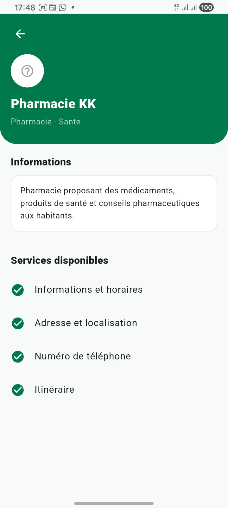
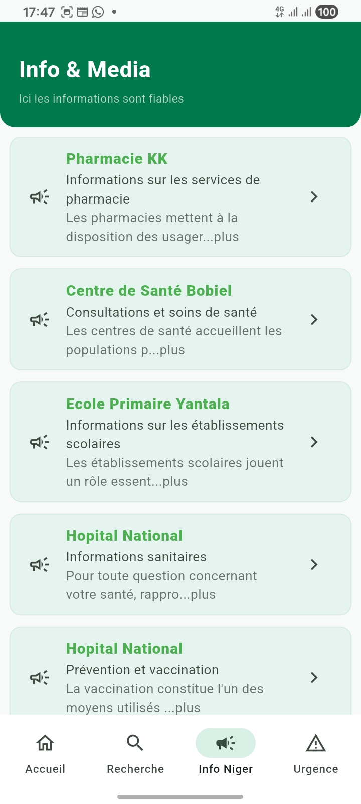
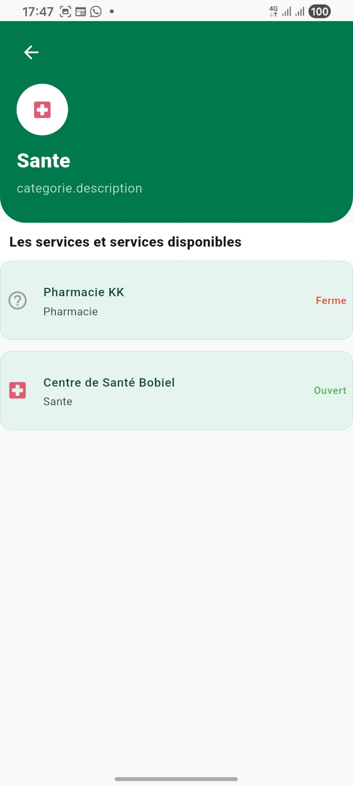
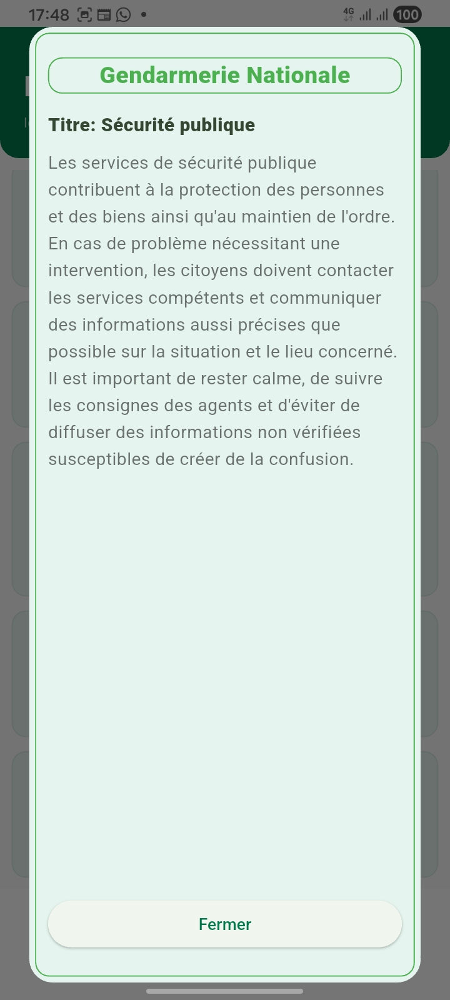
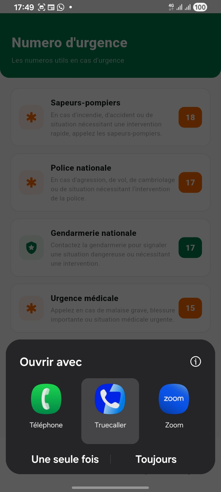

# 🇳🇪 NigerLink

<p align="center">
  <strong>Application mobile de découverte des services et lieux au Niger</strong>
</p>

<p align="center">
  Une application Flutter permettant de rechercher et consulter facilement des services, établissements et lieux utiles au Niger.
</p>

---

## 📱 Présentation

**NigerLink** est une application mobile développée avec **Flutter** dans le but de faciliter l'accès aux informations concernant les services et lieux disponibles au Niger.

L'application permet notamment de :

* 📍 détecter la ville actuelle de l'utilisateur ;
* 🔎 rechercher des services et établissements ;
* 🏷️ consulter les services par catégorie ;
* 🚨 accéder rapidement aux numéros d'urgence ;
* 📄 consulter les détails d'un service ;
* 👤 gérer l'authentification utilisateur ;
* 📱 proposer une interface adaptée aux appareils mobiles.

---

## 🎯 Objectifs du projet

Le projet a pour objectifs de :

1. Centraliser les informations sur les services et lieux utiles.
2. Faciliter la recherche d'un service.
3. Permettre une navigation simple et intuitive.
4. Utiliser la géolocalisation pour identifier la ville de l'utilisateur.
5. Mettre en pratique les concepts de développement mobile avec Flutter.
6. Structurer l'application selon une architecture maintenable.

---

# 🖼️ Captures d'écran

## 🏠 Accueil

L'écran d'accueil présente le nom de l'utilisateur, sa localisation actuelle, les catégories disponibles et l'accès aux numéros d'urgence.

<p align="center">
  
</p>

---

## 📍 Localisation

NigerLink utilise la géolocalisation du téléphone pour déterminer automatiquement la ville de l'utilisateur.


Exemple :

```text
📍 Niamey
```

---

## 🏷️ Catégories

Les services sont organisés par catégories afin de faciliter leur découverte.


Exemples de catégories :

* 🏥 Santé
* 💊 Pharmacies
* 🎓 Écoles
* 🏛️ Universités
* 🚒 Sapeurs-pompiers
* 🏢 Mairies
* 💰 Impôts
* 🏦 Finance
* 🏨 Hôtellerie
* 🍴 Restauration
* 🕌 Culte et religion
* 🛡️ Sécurité
* 🤝 Humanitaire
* 🛍️ Commercial

---

## 🚨 Numéros d'urgence

Une section dédiée permet d'accéder rapidement aux principaux numéros d'urgence.

<p align="center">
  
</p>

---

## 🔎 Recherche

L'utilisateur peut rechercher rapidement un service ou un établissement.

<p align="center">
  
</p>

---

## 📄 Détails d'un service

Chaque service dispose d'une page présentant ses informations principales.

<p align="center">
  
</p>

Les informations peuvent notamment inclure :

* nom du service ;
* catégorie ;
* adresse ;
* téléphone ;
* horaires ;
* disponibilité ;
* localisation ;
* informations complémentaires.

---

# 🛠️ Technologies utilisées

| Technologie  | Utilisation                                              |
| ------------ | -------------------------------------------------------- |
| Flutter      | Développement de l'application mobile                    |
| Dart         | Langage de programmation                                 |
| Provider     | Gestion d'état                                           |
| Geolocator   | Récupération de la position GPS                          |
| Geocoding    | Conversion des coordonnées en informations géographiques |
| Material 3   | Interface utilisateur                                    |
| Git / GitHub | Gestion du code source                                   |

---

# 🏗️ Architecture du projet

Le projet est organisé en plusieurs parties afin de séparer les responsabilités :

```text
lib/
│
├── controllers/
│   ├── auth_controller.dart
│   ├── localisation_controller.dart
│   ├── provider_controller.dart
│   └── search_controller.dart
│
├── models/
│   ├── categorie.dart
│   ├── service.dart
│   ├── place.dart
│   └── ...
│
├── views/
│   ├── screens/
│   │   ├── home_page.dart
│   │   ├── categorie_detail.dart
│   │   ├── emergency_page.dart
│   │   └── ...
│   │
│   └── widgets/
│       ├── categorie_card.dart
│       ├── service_card.dart
│       └── ...
│
└── main.dart
```

---

# 📍 Géolocalisation

L'application utilise le GPS de l'appareil pour récupérer :

```text
Latitude
    ↓
Longitude
    ↓
Géocodage inversé
    ↓
Informations géographiques
    ↓
Ville
```

Par exemple, selon les données retournées par l'appareil :

```text
country: Niger
administrativeArea: Communauté Urbaine de Niamey
subAdministrativeArea: Niamey
```

L'application utilise ensuite l'information appropriée pour afficher :

```text
📍 Niamey
```

---

# 🔐 Permissions

Pour utiliser la géolocalisation sur Android, l'application demande les permissions :

```xml
<uses-permission
    android:name="android.permission.ACCESS_FINE_LOCATION" />

<uses-permission
    android:name="android.permission.ACCESS_COARSE_LOCATION" />
```

La localisation n'est utilisée qu'après l'autorisation de l'utilisateur.

---

# 🎨 Interface utilisateur

L'application utilise une interface basée sur **Material Design 3**.

### Couleur principale

```text
#007A4D
```

Cette couleur est utilisée principalement pour :

* l'en-tête ;
* les éléments principaux ;
* les boutons ;
* l'identité visuelle de NigerLink.

Une couleur orange est également utilisée pour mettre en évidence les informations importantes, notamment les urgences.

---

# ⚙️ Fonctionnalités

### Actuellement disponibles

* [x] Écran d'accueil
* [x] Catégories de services
* [x] Navigation entre les pages
* [x] Détails des catégories
* [x] Détails des services
* [x] Recherche
* [x] Numéros d'urgence
* [x] Géolocalisation
* [x] Affichage de la ville
* [x] Gestion d'état avec Provider
* [x] Authentification

### 🚧 En développement

* [ ] Carte interactive
* [ ] Localisation précise des établissements
* [ ] Itinéraire vers un établissement
* [ ] Notifications
* [ ] Système d'avis
* [ ] Administration des données
* [ ] Backend distant
* [ ] Publication Android

---

# 🚀 Installation

## Prérequis

Avant de lancer le projet, installez :

* Flutter
* Dart
* Android Studio ou VS Code
* Git

Vérifiez votre installation :

```bash
flutter doctor
```

---

## Cloner le projet

```bash
git clone https://github.com/Epiphane-code/NigerLink_App.git
```

Entrer dans le projet :

```bash
cd NigerLink_App
```

Installer les dépendances :

```bash
flutter pub get
```

Lancer l'application :

```bash
flutter run
```

---

# 🧪 Tests et qualité

Le projet fait l'objet de vérifications concernant :

### Fonctionnalité

* [x] Navigation entre les écrans
* [x] Affichage des catégories
* [x] Recherche
* [x] Géolocalisation
* [x] Affichage de la ville
* [x] Gestion des permissions

### Interface

* [x] Interface responsive
* [x] Navigation intuitive
* [x] Cohérence des couleurs
* [x] Lisibilité des textes
* [x] États de chargement

### Qualité du code

* [x] Séparation des responsabilités
* [x] Utilisation de modèles
* [x] Utilisation de contrôleurs
* [x] Gestion d'état avec Provider
* [x] Gestion des erreurs

---

# 📂 Captures d'écran

<p align="center">
  
      
   
   
   
</p>


---

# 👨‍💻 Auteur

**Omar Epiphane**

Développeur Full Stack & Mobile en formation.

* Flutter / Dart
* Python / FastAPI
* HTML / CSS / JavaScript
* PostgreSQL
* Git / GitHub

---

# 📌 Projet

**NigerLink — E-Services Niger**

Application mobile destinée à faciliter l'accès aux informations concernant les services et lieux utiles au Niger.

---

## 📄 Licence

Ce projet est actuellement un projet de développement et d'apprentissage.

© 2026 Omar Epiphane — NigerLink
